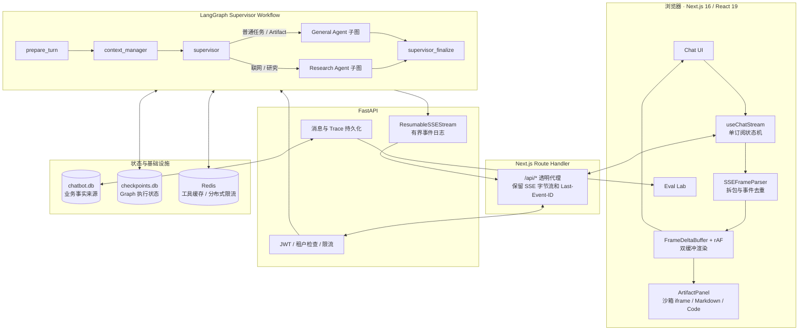
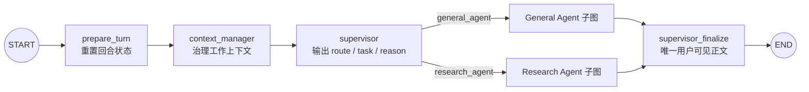
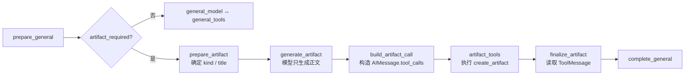
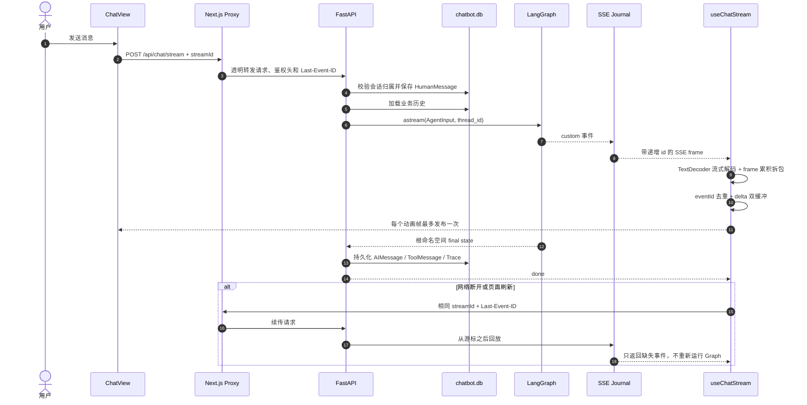

# LangGraph 全栈教程 Chatbot

一个面向 **LangGraph 初学者和全栈 AI 开发学习者** 的可运行教程项目。它不是只展示一次模型调用的聊天壳，而是把一个真实 AI 应用拆成可以阅读、调试和评测的完整链路：任务分派、Multi-Agent、工具执行、Artifact、SSE 流式传输、断点续传、持久化和 Evals。

项目代码优先追求“流程看得见”：业务控制流写成明确的 LangGraph `State / Node / Edge`，关键实现附有中文设计注释；纯 JSON 解析、HTML 清洗等无状态逻辑保留为普通函数，避免为了“全都叫节点”而制造无意义的 Graph。

## 项目定位

### 项目背景

很多 LangGraph 示例只演示 `START → model → END`，学习者仍不知道如何把 Agent 接到登录、数据库、流式 UI、工具和评测系统。本项目提供一套可本地运行的全栈参考实现，用一个 Chatbot 串起这些工程问题。

### 核心难点

1. Multi-Agent 的职责、工具权限和最终回复如何保持单一、可审计的数据流。
2. SSE 如何同时解决 TCP 拆包、逐 token 重渲染、断流重连和重复订阅。
3. 长会话、工具协议、Artifact 与业务消息如何在 checkpoint 和数据库之间保持一致。

### 解决方案

1. 通过 Supervisor 父图和 General/Research 编译子图，实现显式任务分派与严格工作流。
2. 通过增量 SSE Parser、`Last-Event-ID` 日志续传、rAF 双缓冲和单订阅所有权，实现稳定流式输出。
3. 通过业务库、LangGraph checkpointer、工具策略链和 Artifact 标准 tool-call 协议，实现可恢复、可追踪的完整执行链。

### 项目亮点

- 支持带来源引用的 Web/Deep Search，以及 HTML、SVG、Markdown、代码和可打印 PDF 预览 Artifact。
- 30,000 个 SSE delta 的本地 eval 从 30,000 次 UI 发布降到 **469 次，减少 98.44%**。
- 当前包含 **62 项后端测试**，并提供独立 Eval Lab 对比 Token、耗时、调用数和质量。

## 你可以从这个项目学到什么

- 如何设计共享 `AgentState`、输入/输出 Schema、Reducer 和 turn-local 状态。
- 如何把编译后的 LangGraph 子图直接挂到父图，而不是在普通节点里手动转发子图流。
- `Runtime[AgentRuntimeContext]` 为什么只放缓存、工具预算等运行依赖，不放业务流程状态。
- 如何为不同 Agent 配置工具白名单、Schema、额度、缓存、并发和超时。
- 如何把模型生成的交付物转换为标准 `AIMessage.tool_calls → ToolMessage` 协议。
- 如何用 POST SSE 实现流式输出、自动重连、页面刷新续传和会话切换隔离。
- 如何区分业务数据库、LangGraph checkpoint、浏览器临时 draft 和 Redis 缓存。
- 如何为 Agent 建立可重复的性能 eval 和人工质量评测。

## 功能一览

| 用户任务 | 分派与执行 | 结果 |
|---|---|---|
| 普通知识问答、写作、编程 | Supervisor → General Agent | Markdown 答案 |
| 天气、计算 | General Agent → 受控工具节点 | 工具结果 + 最终解释 |
| “生成网页 / SVG / 文档 / PDF” | General Agent → Artifact 专用 DAG | 侧栏预览与源码 |
| 最新信息、联网搜索、事实核验 | Supervisor → Research Agent → Web Search | 带行内引用的回答 |
| 多角度研究 | Research Agent → Deep Search 子图 | 规划、并行检索、证据简报 |
| 长对话 | Context Manager | 摘要、会话记忆、完整工具配对 |
| Agent 优化对比 | Trace Collector → Eval Lab | 版本、Token、耗时、通过率 |

不支持工具调用的模型会隐藏联网按钮。Artifact/PDF 使用确定性工作流，因此即使模型不支持 function calling，也能先生成内容，再由 Graph 构造并执行 `create_artifact`。当前 PDF 是适合 A4 打印的 HTML 预览，可通过浏览器“打印为 PDF”，不是后端二进制 PDF 文件。

## 总体框架图



## LangGraph 工作流

父图只负责一轮任务的准备、分派和整合。General 与 Research 是直接挂载的编译子图；使用 `get_graph(xray=True)` 可以展开看到内部节点。



任务划分遵循三个原则：

1. Supervisor 只分析和分派，不直接执行工具。
2. Worker 的中间文本不直接展示，避免多个 Agent 同时“对用户说话”。
3. 工具调用和工具结果进入共享消息协议，最后由 Supervisor 统一整合。

## Artifact 工作流

Artifact 不是前端从 Markdown 中“猜出来”的内容，而是一条完整工具协议：



后端依次发送 `tool_call_start → tool_call_delta → tool_call_end → tool_result`。前端从增量参数中恢复 `title/kind/content`，按 `conversationId` 写入 Zustand；HTML/SVG 完成后才进入沙箱 iframe，Markdown/代码进入对应渲染器。切换会话时，Artifact 会从已持久化的工具消息恢复，不会串到其他对话。

## 端到端数据流



这里有四种状态，职责不要混淆：

- `chatbot.db`：用户可见消息、会话和 Trace 的业务事实来源。
- `checkpoints.db`：LangGraph 的 thread state，用于持久化执行上下文。
- `ResumableSSEStream`：当前生成任务的短期事件日志，用于断线回放。
- 浏览器 session/draft：页面刷新前的临时 UI 快照，只保存恢复所需最小字段。

## SSE 为什么不会乱码、重复或卡顿

```text
TCP bytes
  → TextDecoder(stream=true)          保留跨 chunk 的 UTF-8 字节
  → SSEFrameParser                    累积不完整 frame，再按空行切分
  → event id cursor                   丢弃已经消费的重复事件
  → FrameDeltaBuffer                  无损累积 text/reasoning/tool delta
  → requestAnimationFrame scheduler   一帧最多提交一次 React state
  → final synchronous flush           done 前同步冲刷尾部数据
```

后端生产任务与某一个 HTTP 连接解耦。组件卸载只关闭当前 reader，不会重启 Graph；相同 `streamId` 的重连只订阅同一日志，因此不会因 HMR、切换会话或刷新产生两三个消费者重复追加同一 token。

## 设计理念

- **显式控制流**：可恢复、有副作用或会改变业务阶段的步骤写成 Node/Edge。
- **单一状态所有权**：业务历史、Graph state、SSE journal、UI draft 各自负责一层。
- **完整工具协议**：始终保持 `AIMessage.tool_calls` 与 `ToolMessage` 成对。
- **能力与模型解耦**：研究和 Artifact 的确定性路由不依赖模型是否支持 function calling。
- **流式但不逐 token 渲染**：网络可以高频，React 发布频率必须受控。
- **先安全再自治**：所有工具经过白名单、Schema、额度、并发、超时和输出裁剪。
- **优化可证明**：性能使用脚本 eval，回答质量使用固定 Case 和 Trace 回放。

## 快速开始

### 1. 准备环境

- Node.js 20+
- Python 3.11+
- DeepSeek API Key
- Redis（可选）

### 2. 安装依赖

```bash
npm install

cd backend
python3 -m venv .venv
.venv/bin/pip install -e ".[dev]"
cd ..
```

### 3. 配置后端

```bash
cp .env.example backend/.env
```

编辑 `backend/.env`，至少填写：

```env
DEEPSEEK_API_KEY=sk-your-api-key
JWT_SECRET=replace-with-a-random-secret
REDIS_ENABLED=0
```

如果需要工具缓存和分布式限流：

```bash
docker compose up -d redis
```

并把 `REDIS_ENABLED` 改为 `1`。

### 4. 启动

```bash
npm run dev:all
```

- Chatbot：<http://localhost:3000>
- Eval Lab：<http://localhost:3000/evals>
- FastAPI Docs：<http://localhost:8000/docs>

## 测试与 Evals

```bash
# 后端架构、持久化、工具和 SSE 回归
backend/.venv/bin/python -m pytest backend -q

# 前端 TypeScript
./node_modules/.bin/tsc --noEmit --incremental false

# SSE 前后性能与协议稳健性
npm run eval:sse

# Next.js 生产构建
npm run build
```

`npm run eval:sse` 会验证 TCP 任意拆包、Unicode、重连回放、重复事件、watchdog、调度器、session 恢复和 Artifact 恢复。独立质量评测流程见 [EVALS.md](./EVALS.md)。

## 建议学习顺序

1. [Graph 总装配](./backend/app/graph/builder.py)：先理解父图 Node/Edge。
2. [共享 State](./backend/app/graph/state.py)：区分业务状态和 Runtime。
3. [General 子图](./backend/app/agents/general.py)：学习条件边和有界工具循环。
4. [Artifact 节点](./backend/app/agents/artifact.py)：学习确定性工具协议。
5. [Research 子图](./backend/app/agents/research.py) 与 [Deep Search](./backend/app/graph/deep_search.py)。
6. [工具策略链](./backend/app/graph/tool_execution.py)：理解工具安全边界。
7. [FastAPI 流入口](./backend/app/routers/chat.py) 与 [可续传日志](./backend/app/streaming.py)。
8. [前端 SSE Parser](./src/lib/sse-stream.ts) 与 [流状态机](./src/hooks/useChatStream.ts)。
9. [Artifact 恢复](./src/lib/artifacts.ts) 与 [侧栏渲染](./src/components/ArtifactPanel.tsx)。
10. [架构测试](./backend/tests/test_agent_architecture.py)：用测试反向理解设计约束。

## 项目结构

```text
.
├── src/
│   ├── app/                 Next.js 页面与 API 代理
│   ├── components/          Chat、Artifact、工具状态与 Eval UI
│   ├── hooks/               SSE 流状态机
│   └── lib/                 Parser、session、store、类型与安全逻辑
├── backend/
│   ├── app/agents/          Supervisor、General、Research、Artifact 节点
│   ├── app/graph/           State、父图、事件、模型、工具与上下文治理
│   ├── app/tools/           工具实现与 ToolPolicy Registry
│   ├── app/routers/         鉴权、会话、Chat SSE、Evals API
│   ├── app/database/        SQLAlchemy、迁移、消息与 Trace
│   └── tests/               Graph、SSE、存储和安全回归
├── scripts/                 SSE 性能与稳健性 eval
├── EVALS.md                 Agent 质量评测说明
└── compose.yaml             可选 Redis
```

后端细节见 [backend/README.md](./backend/README.md)，Graph 节点边界见 [backend/app/graph/README.md](./backend/app/graph/README.md)。

## 技术栈

- 前端：Next.js 16、React 19、TypeScript、Tailwind CSS、Zustand
- Agent：LangGraph 1.x、LangChain Core、Supervisor + Specialized Workers
- 后端：FastAPI、SQLAlchemy Async、Pydantic、POST SSE
- 存储：SQLite、LangGraph AsyncSqliteSaver、可选 Redis
- 模型：DeepSeek 对话/推理模型
- 测试：Pytest、TypeScript、Next Build、自研 SSE Eval
