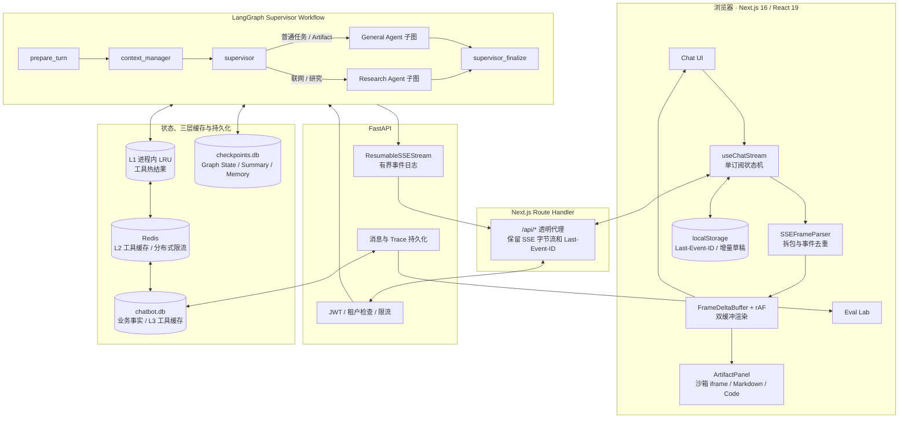
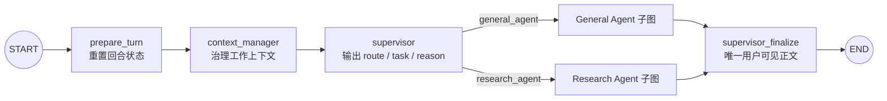
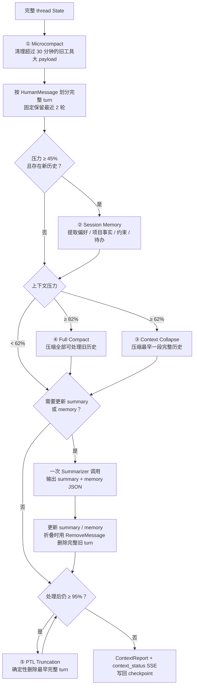
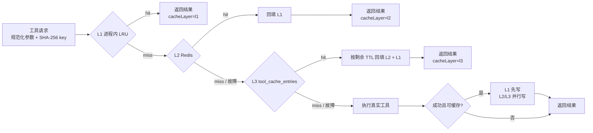
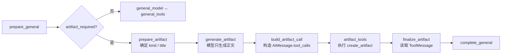
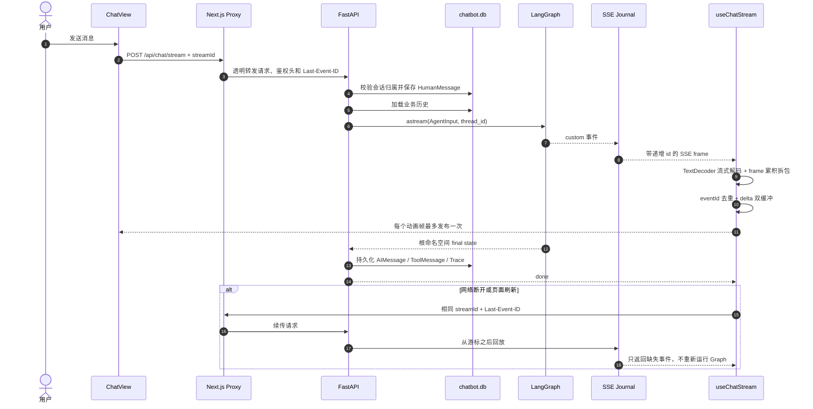

# LangGraph 全栈教程 Chatbot

一个面向 **LangGraph 初学者和全栈 AI 开发学习者** 的可运行教程项目。它不是只展示一次模型调用的聊天壳，而是把一个真实 AI 应用拆成可以阅读、调试和评测的完整链路：任务分派、Multi-Agent、工具执行、Artifact、包含会话记忆的 Context Engineering、L1/L2/L3 工具缓存、持久化、SSE 流式传输、断点续传和 Evals。

项目代码优先追求“流程看得见”：业务控制流写成明确的 LangGraph `State / Node / Edge`，关键实现附有中文设计注释；纯 JSON 解析、HTML 清洗等无状态逻辑保留为普通函数，避免为了“全都叫节点”而制造无意义的 Graph。

## 项目定位

### 项目背景

很多 LangGraph 示例只演示 `START → model → END`，学习者仍不知道如何把 Agent 接到登录、数据库、流式 UI、工具和评测系统。本项目提供一套可本地运行的全栈参考实现，用一个 Chatbot 串起这些工程问题。

### 核心难点

1. Multi-Agent 的职责、工具权限和最终回复如何保持单一、可审计的数据流。
2. 长会话如何在不破坏 AI/Tool 消息配对的前提下完成上下文压缩、记忆提取和窗口兜底。
3. SSE 如何同时解决逐 token 渲染卡顿、断流丢内容、TCP 拆包导致 JSON/Unicode 错乱，以及刷新后的增量恢复。
4. 热点工具结果如何在内存、Redis、数据库之间读穿透与回填，同时不混淆业务数据库、LangGraph checkpoint、SSE 日志和浏览器草稿的职责。

### 解决方案

1. 通过 Supervisor 父图和 General/Research 编译子图，实现显式任务分派与严格工作流。
2. 通过受 Claude Code 长会话治理思路启发的五层 Context Engineering，将工具瘦身、会话记忆、滚动摘要、全量压缩和确定性截断写成可观测策略链。
3. 通过双指针缓冲 + `requestAnimationFrame`、手动重连 + `Last-Event-ID`、Buffer 累积 + SSE 分隔符拆包，实现稳定流式输出；再用游标与草稿增量存储支持刷新恢复。
4. 通过 `L1 内存 → L2 Redis → L3 数据库` 的工具结果缓存降低重复 I/O；再把业务消息、Graph state、SSE Journal 和浏览器 localStorage 按恢复目标分开建模。

### 项目亮点

- 支持带来源引用的 Web/Deep Search，以及 HTML、SVG、Markdown、代码和可打印 PDF 预览 Artifact。
- 内置五层 Context Engineering；`session_memory` 是其中的稳定事实提取策略，不再虚构一套与 Context 平行的“Memory 系统”。
- 工具缓存实现 L1 有界 LRU、L2 Redis、L3 数据库，支持逐级回填、按语义 TTL 和 fail-open；命中层会进入 Trace/SSE。
- 30,000 个 SSE delta 的本地 eval 从 30,000 次 UI 发布降到 **469 次，减少 98.44%**。
- 当前包含 **64 项后端测试**，并提供独立 Eval Lab 对比 Token、耗时、调用数和质量。

## 你可以从这个项目学到什么

- 如何设计共享 `AgentState`、输入/输出 Schema、Reducer 和 turn-local 状态。
- 如何把编译后的 LangGraph 子图直接挂到父图，而不是在普通节点里手动转发子图流。
- `Runtime[AgentRuntimeContext]` 为什么只放缓存、工具预算等运行依赖，不放业务流程状态。
- 如何为不同 Agent 配置工具白名单、Schema、额度、缓存、并发和超时。
- 如何把模型生成的交付物转换为标准 `AIMessage.tool_calls → ToolMessage` 协议。
- 如何用 POST SSE 实现流式输出、自动重连、页面刷新续传和会话切换隔离。
- 如何实现 L1/L2/L3 读穿透与写穿透缓存，并区分业务数据库、LangGraph checkpoint、浏览器临时 draft。
- 如何把滚动摘要与会话记忆分开建模，并用 cursor 避免重复提取同一段历史。
- 如何为 Agent 建立可重复的性能 eval 和人工质量评测。

## 功能一览

| 用户任务 | 分派与执行 | 结果 |
|---|---|---|
| 普通知识问答、写作、编程 | Supervisor → General Agent | Markdown 答案 |
| 天气、计算 | General Agent → 受控工具节点 | 工具结果 + 最终解释 |
| “生成网页 / SVG / 文档 / PDF” | General Agent → Artifact 专用 DAG | 侧栏预览与源码 |
| 最新信息、联网搜索、事实核验 | Supervisor → Research Agent → Web Search | 带行内引用的回答 |
| 多角度研究 | Research Agent → Deep Search 子图 | 规划、并行检索、证据简报 |
| 长对话 | Context Manager | 摘要、会话记忆、完整工具配对 |
| Agent 优化对比 | Trace Collector → Eval Lab | 版本、Token、耗时、通过率 |

不支持工具调用的模型会隐藏联网按钮。Artifact/PDF 使用确定性工作流，因此即使模型不支持 function calling，也能先生成内容，再由 Graph 构造并执行 `create_artifact`。当前 PDF 是适合 A4 打印的 HTML 预览，可通过浏览器“打印为 PDF”，不是后端二进制 PDF 文件。

## 总体框架图



## LangGraph 工作流

父图只负责一轮任务的准备、分派和整合。General 与 Research 是直接挂载的编译子图；使用 `get_graph(xray=True)` 可以展开看到内部节点。



任务划分遵循三个原则：

1. Supervisor 只分析和分派，不直接执行工具。
2. Worker 的中间文本不直接展示，避免多个 Agent 同时“对用户说话”。
3. 工具调用和工具结果进入共享消息协议，最后由 Supervisor 统一整合。

## Context Engineering：受 Claude Code 启发的五层治理

本项目受 Claude Code 在长会话中分层治理上下文的思路启发，但没有照搬其内部实现，而是把适合教程项目的策略重新设计成一个显式 `context_manager` 节点。它在 Supervisor 分派前运行，只压缩 **模型工作上下文与 checkpoint state**；`chatbot.db` 中用户实际看到的完整消息仍然保留。



| 层级 | 默认触发 | 解决的问题 | 关键保护 |
|---|---:|---|---|
| ① `microcompact` | ToolMessage 超过 30 分钟 | 旧搜索/工具大结果长期占窗口 | 保留 message ID、tool call ID、状态和协议元数据 |
| ② `session_memory` | 压力达到 45% | 从早期历史提取用户偏好、项目事实、约束、命名约定和长期待办 | `session_memory_cursor` 保证同一段历史不重复提取 |
| ③ `context_collapse` | 压力达到 62% | 将最早一部分完整 turn 变成滚动摘要 | 保留最近 2 轮，不拆 AI tool-call / ToolMessage |
| ④ `full_compact` | 压力达到 82% | 一次压缩全部可处理旧历史 | 模型失败时使用有界本地摘要，主流程 fail-open |
| ⑤ `ptl_truncation` | 压缩后仍达到 95% | 最终确定性兜底，防止超过模型输入预算 | 只删除最早完整 turn，绝不删除当前 turn |

策略执行后会产生 `ContextReport`，记录压缩前后估算 Token、采用的策略、移除消息数和是否仍超限，并通过 `context_status` SSE 显示在前端活动时间线。更详细的代码路径见 [`context_manager.py`](./backend/app/graph/context_manager.py)。

### Session Memory：Context Engineering 中的稳定事实层

本项目没有把 Memory Engineering 另立成一套平行系统；会话记忆就是五层 Context Engineering 中的第二层。它把“历史消息”“滚动摘要”和“长期有用事实”分开建模：

- `messages`：完整 LangChain 消息协议，包含 Human/AI/Tool 配对，是当前 thread 的执行历史。
- `context_summary`：按时间保留任务、决定、结论、未完成事项和重要工具结论，用于替代已折叠的旧 turn。
- `session_memory`：只保存用户偏好、身份/项目事实、约束、命名约定和长期待办，作为当前会话的记忆文档。
- `session_memory_cursor`：记录记忆已经处理到哪条消息，避免每轮重复总结和重复消耗 Token。

`context_summary` 与 `session_memory` 会作为不同的 SystemMessage 注入模型视图，并明确标记为“历史事实而非新指令”。它们随 LangGraph thread checkpoint 持久化，作用域是当前会话，不伪装成跨用户的全局长期记忆；业务消息仍以 `chatbot.db` 为事实来源。当数据库历史与 checkpoint 不一致时，API 会删除旧 thread checkpoint，再用业务历史重建。

## L1/L2/L3 工具缓存

只有搜索、天气、计算等公开且幂等的工具结果进入三层缓存。Artifact、错误结果、用户私有消息和 Graph state 都不会被缓存。严格读取路径如下：



| 缓存层 | 实现与速度定位 | 命中后的动作 | 故障策略 |
|---|---|---|---|
| L1 | 当前 FastAPI 进程内的 1,024 项有界 LRU | 直接返回，无网络与序列化 | 进程重启自然丢失，由下层恢复 |
| L2 | Redis，共享给多个后端进程 | 保留原始绝对过期时间并回填 L1 | 连接错误熔断 30 秒，继续查 L3 |
| L3 | `chatbot.db.tool_cache_entries` | 按剩余 TTL 回填 Redis 与 L1 | 读写异常 fail-open，继续执行真实工具 |

三层使用同一个绝对 `expires_at`，因此从 L3 晋升不会重置或延长 TTL。默认 TTL：Web Search 300 秒、Deep Search 600 秒、天气 60 秒、计算 24 小时。Key 由规范化参数、缓存版本和必要的 `model_id` 计算 SHA-256，参数顺序不会制造假 miss，原始查询也不会直接出现在 key 中。

### 它与其他状态存储的边界

下面这些组件不是 L1/L2/L3 缓存；它们保存的是不同数据，并服务于不同恢复目标：

| 层 | 实现 | 保存什么 | 生命周期与降级策略 |
|---|---|---|---|
| React/Zustand 工作态 | ref、Zustand | 当前可见消息、每个对话的 Artifact、AbortController | 高频 delta 只进 ref；按绘制帧同步 UI，切换会话按 `conversationId` 隔离 |
| 浏览器增量存储 | localStorage | `streamId`、原始请求、`Last-Event-ID`、未完成 assistant parts | 首字节前保存 session；游标逐事件更新，草稿约 300ms 节流；`done/error` 后清理 |
| SSE 事件日志 | `ResumableSSEStream` | 带单调 event ID 的短期 custom 事件 | 单流最多 20,000 个事件，终态默认保留 5 分钟；过期明确报错，不静默缺段 |
| Redis 限流状态 | Lua Token Bucket | 多进程共享令牌 | 与 L2 工具缓存复用 Redis 客户端，但不是同一类数据；故障时退化到进程内限流 |
| 业务持久化 | `chatbot.db` | 用户、会话、消息 parts、Tool/Artifact、来源和 Trace | 用户可见内容的唯一事实来源；同库的 `tool_cache_entries` 只是可删除、可重建的 L3 派生数据 |
| Graph 持久化 | `checkpoints.db` | `AgentState`、消息 reducer、summary、memory、子图进度 | `conversation_id = thread_id`；支持 LangGraph thread 恢复，不替代业务数据库 |

## Artifact 工作流

Artifact 不是前端从 Markdown 中“猜出来”的内容，而是一条完整工具协议：



后端依次发送 `tool_call_start → tool_call_delta → tool_call_end → tool_result`。前端从增量参数中恢复 `title/kind/content`，按 `conversationId` 写入 Zustand；HTML/SVG 完成后才进入沙箱 iframe，Markdown/代码进入对应渲染器。切换会话时，Artifact 会从已持久化的工具消息恢复，不会串到其他对话。

## 端到端数据流



端到端恢复时尤其不要混淆下面四类状态；Redis 只是可选加速/限流层，完整分层见前文表格：

- `chatbot.db`：用户可见消息、会话和 Trace 的业务事实来源。
- `checkpoints.db`：LangGraph 的 thread state，用于持久化执行上下文。
- `ResumableSSEStream`：当前生成任务的短期事件日志，用于断线回放。
- 浏览器 session/draft：页面刷新前的临时 UI 快照，只保存恢复所需最小字段。

## 前端 SSE 三大痛点与增量存储

| 痛点 | 根因 | 解决方案 |
|---|---|---|
| 1. 卡顿：逐字渲染卡死浏览器 | 每个 token 都拼接整段字符串、触发 React state 和 Markdown 重解析 | `FrameDeltaBuffer` 使用写指针/发布指针无损累积，网络 append 为 O(1)；`requestAnimationFrame` 每个绘制帧最多提交一次，隐藏标签页用 timeout 兜底 |
| 2. 断流：重连后内容丢失或重复 | `reader.read()` 半开、HTTP 连接与生成任务耦合、重连重新执行请求 | 前端手动指数退避重连，携带同一 `streamId + Last-Event-ID`；后端 producer 与 HTTP subscriber 解耦，只从 SSE Journal 回放游标后的事件 |
| 3. 错乱/乱码：TCP 拆包后 JSON 解析失败 | TCP chunk 不等于 SSE event，UTF-8 多字节字符、SSE frame、JSON 甚至 JS 代理对都可能跨 chunk | `TextDecoder(stream=true)` 保留半个 UTF-8 字符，`SSEFrameParser` 先 Buffer 累积再按空行分隔符拆帧，完整 `data:` 才 JSON.parse；双缓冲暂存尾部高代理，避免短暂显示 `�` |

```text
TCP bytes
  → TextDecoder(stream=true)          保留跨 chunk 的 UTF-8 字节
  → SSEFrameParser                    累积不完整 frame，再按空行切分
  → event id cursor                   丢弃已经消费的重复事件
  → FrameDeltaBuffer                  无损累积 text/reasoning/tool delta
  → requestAnimationFrame scheduler   一帧最多提交一次 React state
  → final synchronous flush           done 前同步冲刷尾部数据
```

后端生产任务与某一个 HTTP 连接解耦。组件卸载只关闭当前 reader，不会重启 Graph；相同 `streamId` 的重连只订阅同一日志，因此不会因 HMR、切换会话或刷新产生两三个消费者重复追加同一 token。

### 前端增量存储如何工作

1. 发起请求前先把 `streamId + requestBody` 写入 localStorage，即使在首字节前刷新也有恢复依据。
2. 每个 SSE frame 都推进共享 cursor；每批成功分发后只要游标变化就立即保存 `Last-Event-ID`，重复或倒退事件直接丢弃。
3. 合帧后的 assistant parts 以约 300ms 间隔保存 draft；`pagehide`/页面隐藏时同步冲刷最后一帧。
4. 刷新后先等待数据库历史，再恢复 draft 到 ref 双缓冲，并从同一游标继续追加，避免草稿跑到对应用户消息之前。
5. 切换对话会取消旧 HTTP reader，但不会取消后端 producer；每条流使用独立 AbortSignal 和 `conversationId` 作用域，迟到事件不能写入新对话。
6. 收到 `done/error` 后清除 session/draft；若后端重启或日志过期，则保留已有局部内容并明确提示，绝不盲目重跑任务。

## 设计理念

- **显式控制流**：可恢复、有副作用或会改变业务阶段的步骤写成 Node/Edge。
- **单一状态所有权**：业务历史、Graph state、SSE journal、UI draft 各自负责一层。
- **完整工具协议**：始终保持 `AIMessage.tool_calls` 与 `ToolMessage` 成对。
- **能力与模型解耦**：研究和 Artifact 的确定性路由不依赖模型是否支持 function calling。
- **流式但不逐 token 渲染**：网络可以高频，React 发布频率必须受控。
- **先安全再自治**：所有工具经过白名单、Schema、额度、并发、超时和输出裁剪。
- **优化可证明**：性能使用脚本 eval，回答质量使用固定 Case 和 Trace 回放。

## 快速开始

### 1. 准备环境

- Node.js 20+
- Python 3.11+
- DeepSeek API Key
- Redis（可选）

### 2. 安装依赖

```bash
npm install

cd backend
python3 -m venv .venv
.venv/bin/pip install -e ".[dev]"
cd ..
```

### 3. 配置后端

```bash
cp .env.example backend/.env
```

编辑 `backend/.env`，至少填写：

```env
DEEPSEEK_API_KEY=sk-your-api-key
JWT_SECRET=replace-with-a-random-secret
REDIS_ENABLED=0
```

如果需要工具缓存和分布式限流：

```bash
docker compose up -d redis
```

并把 `REDIS_ENABLED` 改为 `1`。

### 4. 启动

```bash
npm run dev:all
```

- Chatbot：<http://localhost:3000>
- Eval Lab：<http://localhost:3000/evals>
- FastAPI Docs：<http://localhost:8000/docs>

## 测试与 Evals

```bash
# 后端架构、持久化、工具和 SSE 回归
backend/.venv/bin/python -m pytest backend -q

# 前端 TypeScript
./node_modules/.bin/tsc --noEmit --incremental false

# SSE 前后性能与协议稳健性
npm run eval:sse

# Redis-only 基线与三层缓存热路径性能、L2/L3 回填正确性
npm run eval:cache

# Next.js 生产构建
npm run build
```

`npm run eval:sse` 会验证 TCP 任意拆包、Unicode、重连回放、重复事件、watchdog、调度器、session 恢复和 Artifact 恢复。`npm run eval:cache` 使用固定 1ms Redis RTT 和临时 SQLite，对比改造前 Redis-only 与改造后 L1 热路径，同时验证 L2→L1、L3→L2/L1 和 Redis 故障回退。独立质量评测流程见 [EVALS.md](./EVALS.md)。

## 建议学习顺序

1. [Graph 总装配](./backend/app/graph/builder.py)：先理解父图 Node/Edge。
2. [共享 State](./backend/app/graph/state.py)：区分业务状态和 Runtime。
3. [Context Manager](./backend/app/graph/context_manager.py) 与 [模型上下文构造](./backend/app/graph/model.py)：理解五层 Context 和 session memory。
4. [General 子图](./backend/app/agents/general.py)：学习条件边和有界工具循环。
5. [Artifact 节点](./backend/app/agents/artifact.py)：学习确定性工具协议。
6. [Research 子图](./backend/app/agents/research.py) 与 [Deep Search](./backend/app/graph/deep_search.py)。
7. [工具策略链](./backend/app/graph/tool_execution.py) 与 [三层缓存](./backend/app/cache.py)：理解 L1/L2/L3 晋升、TTL 和 fail-open 边界。
8. [FastAPI 流入口](./backend/app/routers/chat.py) 与 [可续传日志](./backend/app/streaming.py)。
9. [前端 SSE Parser](./src/lib/sse-stream.ts)、[增量存储](./src/lib/sse-session.ts) 与 [流状态机](./src/hooks/useChatStream.ts)。
10. [Artifact 恢复](./src/lib/artifacts.ts) 与 [侧栏渲染](./src/components/ArtifactPanel.tsx)。
11. [架构测试](./backend/tests/test_agent_architecture.py)：用测试反向理解设计约束。

## 项目结构

```text
.
├── src/
│   ├── app/                 Next.js 页面与 API 代理
│   ├── components/          Chat、Artifact、工具状态与 Eval UI
│   ├── hooks/               SSE 流状态机
│   └── lib/                 Parser、session、store、类型与安全逻辑
├── backend/
│   ├── app/agents/          Supervisor、General、Research、Artifact 节点
│   ├── app/graph/           State、父图、事件、模型、工具与上下文治理
│   ├── app/tools/           工具实现与 ToolPolicy Registry
│   ├── app/routers/         鉴权、会话、Chat SSE、Evals API
│   ├── app/database/        SQLAlchemy、迁移、消息与 Trace
│   └── tests/               Graph、SSE、存储和安全回归
├── scripts/                 SSE 与三层缓存性能/稳健性 eval
├── EVALS.md                 Agent 质量评测说明
└── compose.yaml             可选 Redis
```

后端细节见 [backend/README.md](./backend/README.md)，Graph 节点边界见 [backend/app/graph/README.md](./backend/app/graph/README.md)。

## 技术栈

- 前端：Next.js 16、React 19、TypeScript、Tailwind CSS、Zustand
- Agent：LangGraph 1.x、LangChain Core、Supervisor + Specialized Workers
- 后端：FastAPI、SQLAlchemy Async、Pydantic、POST SSE
- 存储：SQLite、LangGraph AsyncSqliteSaver、可选 Redis
- 模型：DeepSeek 对话/推理模型
- 测试：Pytest、TypeScript、Next Build、自研 SSE/Cache Eval
