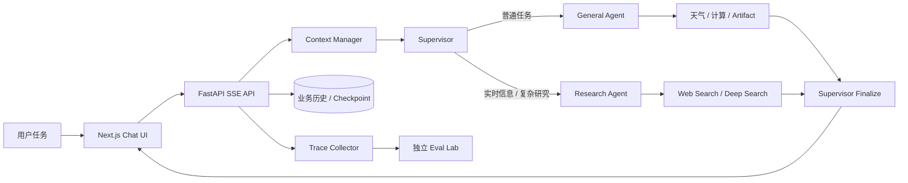

# DeepSeek Agent Workspace

> 一个能把用户需求转化为“研究、计算、工具执行和可交付工件”的 AI Agent 工作台，并通过独立 Eval Lab 持续衡量每轮优化的质量、成本与稳定性。

这不是一个只负责陪聊的 Chatbot，也不是简单套壳的模型 UI。系统会先判断任务类型，再把工作交给对应 Agent：普通任务由 General Agent 执行，实时信息与复杂研究由 Research Agent 完成，最终由 Supervisor 汇总成一个可直接使用的结果。

## 它解决什么业务问题

知识工作中的很多需求并不是“回答一句话”，而是一个小型任务闭环：理解目标、选择信息源、调用工具、整理证据、生成交付物，并在后续迭代中验证效果。

本项目把这个闭环做成了一个完整系统：

```text
用户提出目标
  → Supervisor 判断任务与分工
  → 专用 Agent 调用受控工具
  → 生成答案 / 研究报告 / 代码 / HTML / SVG / Markdown
  → 保存会话、引用、工具结果与运行 Trace
  → Eval Lab 对比不同优化版本的质量、Token、耗时和调用膨胀
```

它适合用于产品调研、技术研究、信息核验、数据计算、内容整理、代码生成、轻量页面原型，以及需要多轮上下文持续推进的任务。

## 它能完成哪些任务

| 用户任务 | 系统如何执行 | 最终产出 |
|---|---|---|
| “调研某项技术最近的发展，并给出可靠来源” | Research Agent 执行快速搜索或 Deep Search，去重并整理证据 | 带行内引用的研究结论 |
| “把这个产品想法做成一个可预览页面” | General Agent 调用 `create_artifact` | 可预览 HTML、SVG、代码或 Markdown 工件 |
| “计算方案成本，并结合已有信息给建议” | Agent 调用计算工具，再由 Supervisor 解释结果 | 结构化计算结果与建议 |
| “继续上次的项目讨论，不要丢掉约束” | 分层上下文管理提取会话记忆并压缩旧历史 | 保留偏好、事实、约束和未完成事项的连续对话 |
| “查询天气或其他确定性信息” | 调用对应工具并返回结构化结果 | 可追踪的工具结果，而不是模型猜测 |
| “比较这次 Agent 优化是否真的有效” | 自动记录运行 Trace，在独立 `/evals` 页面按代码版本聚合 | Token、耗时、调用数、通过率与事件回放 |

## 为什么它比较特别

### 1. 从“回答问题”升级为“完成任务”

Supervisor 不直接包办所有工作，而是生成可审计的 `route / task / reason` 分派。General Agent 和 Research Agent 拥有明确职责边界，最终答案再由 Supervisor 统一整合，避免多个 Agent 同时对用户说话或重复执行任务。

### 2. 研究结果带证据，而不是只给结论

Research Agent 支持快速 Web Search 和有界 Deep Search。深度搜索会规划 1–3 个检索方向、并行收集来源、去重并生成研究摘要；重要事实通过 `[[cite:n]]` 映射到真实来源，并在会话重载后继续保留。

### 3. 不只输出文本，还能生成可交付工件

模型可以调用 `create_artifact` 生成完整代码、HTML、SVG 或 Markdown。工件在独立侧栏展示，支持源码查看、复制和安全预览，因此用户拿到的不只是解释，还可以直接拿到页面原型、代码文件或文档。

### 4. 长对话不是简单截断

系统根据上下文压力逐级应用工具结果瘦身、会话记忆、分段摘要、全量压缩和最终截断。它优先保留用户偏好、项目事实、约束、约定与未完成事项，同时保证 AI Tool Call 不会与对应 ToolMessage 分离。

### 5. 工具调用有明确安全边界

所有工具统一经过：

```text
Worker 白名单 → Schema 校验 → 回合额度 → 权限确认
→ 精确缓存 → 并发安全调度 → 超时与取消
→ 输出裁剪 → ToolMessage + State Patch + Trace
```

当前策略包括：

- 每批最多 3 个工具调用
- 每回合最多 6 个工具调用
- 最大并发数 3
- `deep_search`、`create_artifact` 每回合最多一次
- 每个工具独立超时和输出上限
- 修改 Graph State 的工具串行执行，每批最多一个 State Patch
- Artifact 最多 100,000 字符，并使用无同源权限的 iframe 与严格 CSP 预览

### 6. 每轮 Agent 优化都能被证明

项目内置独立的 Eval Lab，而不是在 Chatbot 页面里塞一块监控面板。每次运行都会记录代码指纹、模型 Token、LLM/工具调用、缓存、耗时、上下文策略、输出大小、拒绝和超时原因。评测人员可以绑定固定 Case、判定通过与否，并比较最近多个版本。

详见 [EVALS.md](./EVALS.md)。

## 核心架构



核心数据边界：

- `chatbot.db`：用户、会话和可见消息的业务事实来源
- `checkpoints.db`：LangGraph 可恢复执行状态，可从业务历史重建
- Redis：工具精确缓存和分布式限流；不可用时自动降级，不影响基本对话
- Trace：随消息保存的运行元数据，用于版本比较和事件回放

## 工程效果

针对原本可能一次并发执行大量工具的问题，确定性回归结果如下：

| 指标 | 优化前 | 当前策略 |
|---|---:|---:|
| 单批实际执行 | 8 | 3 |
| 峰值并发 | 8 | 3 |
| 模型接收的单个工具结果 | 20,046 字符 | 最多 4,000 字符 |
| 同回合 `deep_search` | 可跨批执行 2 次 | 最多 1 次 |
| 20 万字符 Artifact | 接受 | Schema 拒绝 |

当前后端测试共 **48 项通过**，Next.js 生产构建通过。

## 快速开始

### 1. 安装前端依赖

```bash
npm install
```

### 2. 创建 Python 环境并安装后端

```bash
cd backend
python3 -m venv .venv
.venv/bin/pip install -e ".[dev]"
cp ../.env.local.example .env
```

编辑 `backend/.env`，填入 DeepSeek API Key：

```env
DEEPSEEK_API_KEY=sk-...
```

### 3. 启动系统

```bash
cd ..
npm run dev:all
```

访问：

- Chatbot：[http://localhost:3000](http://localhost:3000)
- Eval Lab：[http://localhost:3000/evals](http://localhost:3000/evals)
- Backend API Docs：[http://localhost:8000/docs](http://localhost:8000/docs)

Redis 是可选依赖。如需启用工具缓存和分布式限流：

```bash
docker compose up -d redis
```

## 测试与构建

```bash
cd backend
.venv/bin/pytest -q

cd ..
npm run build
```

## 技术栈

- 前端：Next.js 16、React 19、TypeScript、Tailwind CSS v4、Zustand
- Agent：LangGraph 1.x、LangChain Core、Supervisor + Specialized Workers
- 后端：FastAPI、SQLAlchemy Async、Pydantic、POST SSE
- 存储：SQLite 业务库、LangGraph AsyncSqliteSaver、Redis
- 模型：DeepSeek V4 Flash / V4 Pro / V3 / R1
- 可观测：代码指纹版本、Token/调用/耗时指标、工具级 Trace、人工 Case 评测

## 项目结构

```text
src/
├── app/                 Chatbot、登录、Eval Lab 与 API 代理
├── components/          对话、Artifact、工具状态和评测界面
├── hooks/               SSE 流式消息状态机
└── lib/                 API、类型、状态管理和 Artifact 安全

backend/app/
├── agents/              Supervisor、General、Research Agent
├── graph/               LangGraph、上下文管理、深度搜索和工具执行链
├── tools/               工具实现、ToolPolicy 与 ToolRegistry
├── routers/             鉴权、会话、聊天与评测 API
├── database/            业务数据、Trace 持久化和迁移
└── observability.py     每轮运行的指标与事件采集
```

更详细的后端设计见 [backend/README.md](./backend/README.md)。
